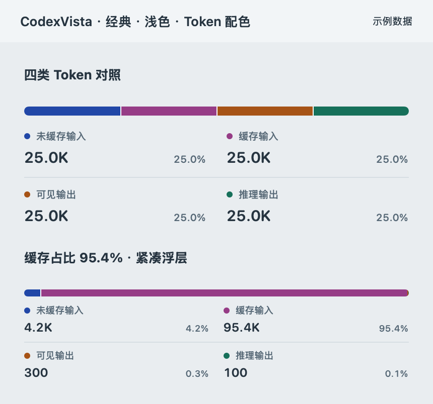
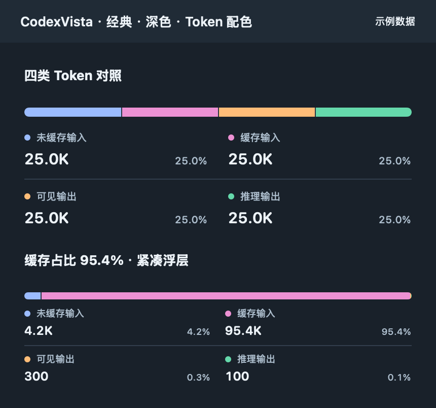
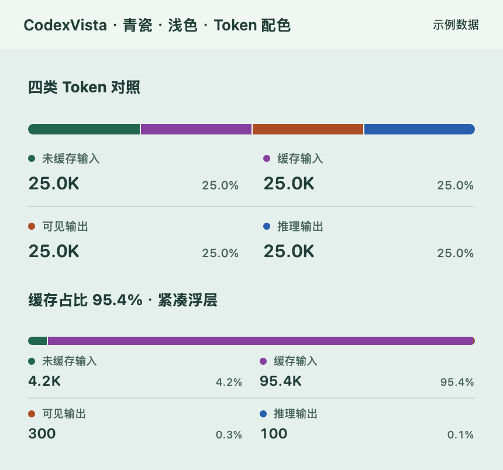
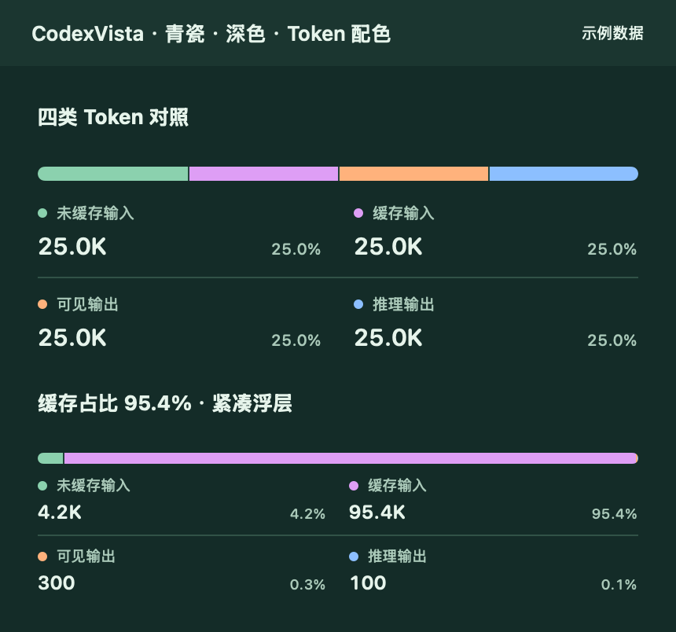
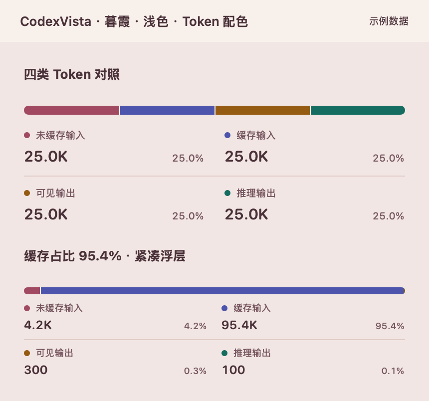
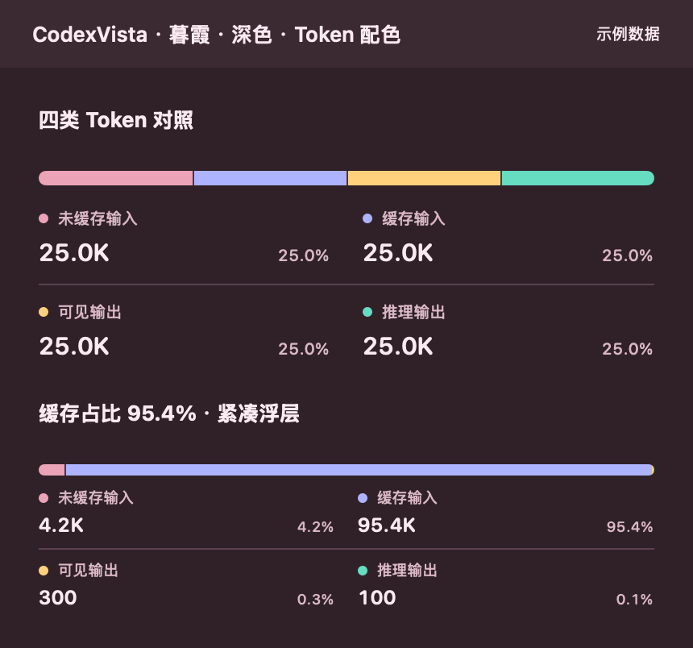
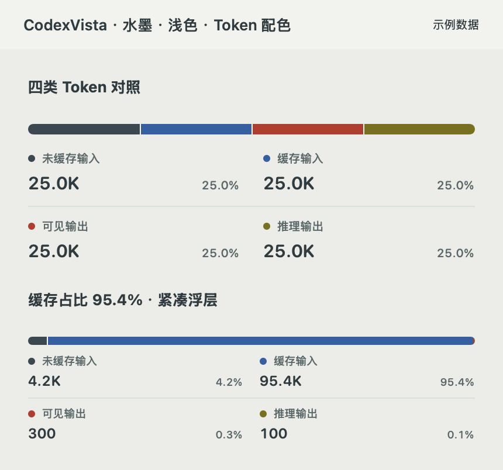
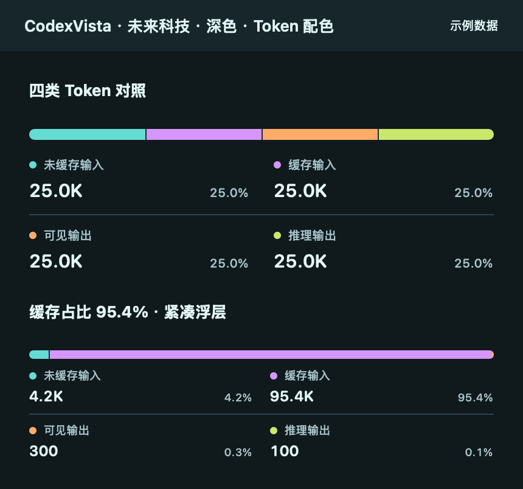
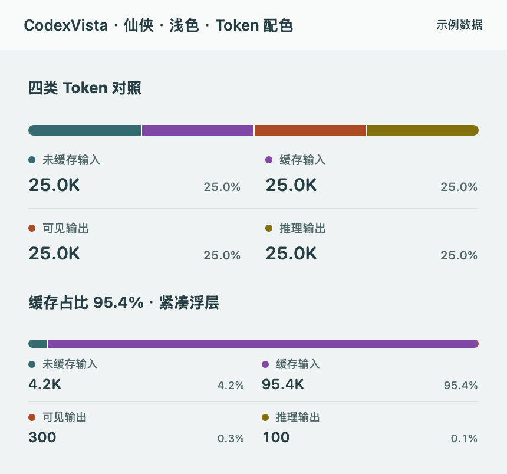

# Token 分类配色

每张图展示等量四分项和缓存占比 95.4% 的紧凑样式。分类色与图例一致，保持真实占比；极小色段不设最小宽度，以文字占比辅助读取。

| 皮肤 | 浅色 | 深色 |
| --- | --- | --- |
| 经典 |  |  |
| 青瓷 |  |  |
| 暮霞 |  |  |
| 水墨 |  | 该皮肤固定使用另一色系 |
| 未来科技 | 该皮肤固定使用另一色系 |  |
| 仙侠 |  | 该皮肤固定使用另一色系 |
